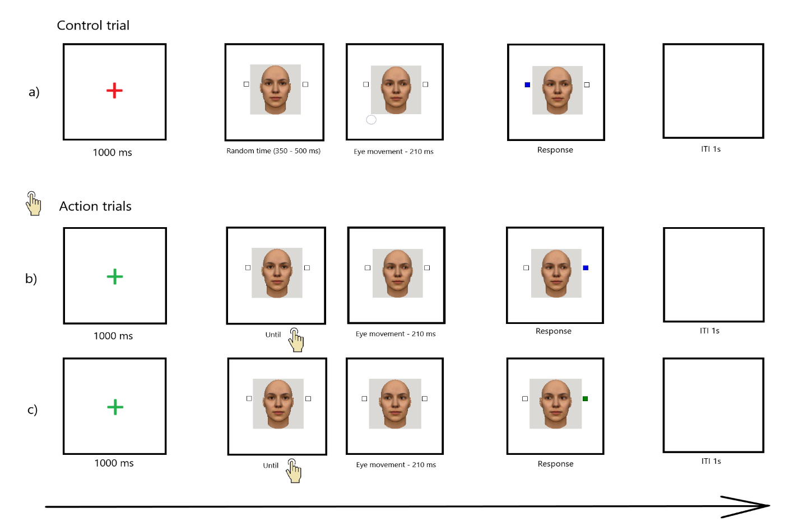

**Part V --- Rationale for the Current Study *(3--4 pages)***

Current Study

The present experiment is the first part of a larger research program investigating how different types of actions---ranging from bodily movements to minimal oculomotor shifts---interact with attentional and social-perceptual mechanisms such as gaze cueing.

Despite its theoretical significance and centrality to volitional behavior, the influence of the sense of agency on attentional processes---specifically gaze cueing---remains poorly understood. While prior research has shown that gaze behavior can influence SoA (e.g., mutual gaze enhancing agency; Ulloa et al., 2019; Stephenson et al., 2018), the reverse relationship---whether agency modulates the perceptual and attentional impact of gaze cues---has not been directly tested. Our study addresses this gap by investigating whether SoA shapes the strength of GCE.

In this experiment, we operationalize SoA through intentional (action--outcome) consistency: whether the direction of a gaze shift aligns with the participant's intention. Participants perform a color discrimination task in which a synthetic face with dynamic pupil motion precedes target onset. In active trials, participants choose a gaze direction, which then either is consistent or inconsistent with the resulting gaze direction. In passive (control) trials, gaze direction is externally "determined" and participants have no control over it. The gaze direction itself is either valid (target appears on the same side) or invalid (opposite side), allowing us to measure whether agency/action control modulates the behavioral impact of gaze cues. Finally, we have chosen discrimination between two very similar colors to make the task more difficult (hence, slow) in order to open some 'space' for the agency to penetrate the GCE.

This design allows us to examine whether internal states like SoA shape social attention. Drawing on predictive processing (Friston, 2012; Wolpert & Kawato, 1998) and cue integration frameworks (Pacherie, 2013), as well as empirical findings showing that congruent action--outcome relationships enhance both agency and attentional salience (Wenke et al., 2010; Gutzeit et al., 2024), we propose that the effectiveness of gaze cues will vary systematically with perceived agency.

Specifically, we expected enhanced gaze cueing effect in action-outcome intentionally consistent condition, where participants' chosen direction would be followed by an intended gaze shift, reinforcing predictive consistency and strengthening SoA. By contrast, action-outcome intentionally inconsistent trials might weaken or disrupt cueing, as the violated expectation likely would reduce perceived agency. Passive/control trials, in which no volitional input would be involved, were expected to yield an intermediate effect, reflecting neither enhanced agency nor explicit violation of expectations.

This approach inverts previous paradigms focused on how gaze influences agency (Gutzeit et al., 2024; Ulloa et al., 2019), offering instead a novel framework for understanding whether and how SoA can act as a top-down modulator of gaze-guided attention. The findings extend gaze cueing research into the domain of volitional control and predictive inference, highlighting the bidirectional interplay between internal states and social cues. Moreover, our work has broader implications: real-world joint attention and social coordination often depend on a person's perceived role as an initiator or responder. Understanding how perceived action control modulates attention to gaze direction can enrich cognitive models of social perception, and have practical applications in education, therapy, and the design of socially responsive artificial agents.

---

## Paradigm and Procedure *(shared across all three experiments)*

> 📌 The content below is common to Experiments 1, 2, and 3 — each experiment's own Method section reports only what differs: the direction-selection response modality, its counterbalancing scheme, apparatus, and participant sample.

Participants were first informed about the experimental instructions. Each experiment began with a practice phase equivalent to the main experimental procedure. Given the complexity of the design, the practice phase was included to ensure that participants fully understood the task requirements. The practice phase consisted of 20 trials, and data from these trials were not included in the analyses. Following the practice phase, the instructions were presented again, after which participants completed the main experimental phase.

All three experiments used a within-subjects design with two factors. The gaze congruency factor had two levels: congruent, when the gaze was oriented toward the target position, and incongruent, when the gaze was oriented in the opposite direction. Action consistency referred to the relationship between the participant's intended action direction and the actual direction of gaze — that is, whether the gaze followed the direction chosen by the participant. This factor comprised three levels: control, for trials in which no directional choice was required; consistent, when the gaze was aligned with the participant's chosen direction; and inconsistent, when the gaze was oriented opposite to the participant's chosen direction.

Each trial combined two consecutive tasks. First, to induce a sense of agency, participants performed a **direction-selection response**: they selected the direction of the upcoming gaze movement before it occurred. In two-thirds of trials (active trials), participants actively selected the gaze direction; in half of these, the gaze direction matched the participant's choice (consistent trials), and in the other half it moved in the opposite direction (inconsistent trials). In the remaining third of trials (control trials), no directional choice was required; gaze direction was randomly determined, with equal probability of moving left or right. The modality of this response is the one respect in which the three experiments differ — keypress in Experiment 1, mouse click in Experiment 2, touchscreen touch in Experiment 3 (see each experiment's own Method section for its specific implementation and counterbalancing scheme). 
To account for individual differences in prospective components of sense of agency, including intention formation, action preparation, motor readiness, and prediction of the expected action outcome, action initiation time was also recorded in this task. Initiation time was defined as the interval between the presentation of the face and the participant’s directional response that triggered the avatar’s gaze movement. By including this measure, we aimed to obtain a cleaner estimate of the effect of action–outcome consistency while reducing the influence of other prospective agency-related processes. This action initiation time was used later as a covariate variable in the statistical analysis part. 

The direction-selection response was followed by a modified version of the standard gaze-cueing paradigm (Friesen & Kingstone, 1998; Driver et al., 1999). A centrally presented face was accompanied by two rectangles positioned on either side. After the gaze movement ended, one of the rectangles (the target) changed color to either green or blue, and participants performed the **target-discrimination response**: a color discrimination task completed by pressing a response button (the a/d key pair, in all three experiments). Reaction time was measured in this task - it was defined as the time between the target onset and the target discrimination response in milliseconds. 

Each trial proceeded as follows:

1\. A fixation symbol appeared at the center of the screen for 1 s: a cross ("+") or an asterisk ("\*"), one signaling a control trial (no action required) and the other signaling an active trial requiring the direction-selection response. The assignment of symbol to trial type was counterbalanced across participants.

2\. The face was then presented looking straight ahead. In control trials, the face remained on screen for a random duration between 350 and 550 ms -- this randomization is deliberate: it removes any stable temporal regularity a participant could learn and use to predict *when* the target will appear, so that control trials carry no temporal-prediction advantage to confound with the active conditions. In active trials, the face remained until the participant gave the direction-selection response; the interval between face onset and this response constitutes the **initiation time**, later used as an ANCOVA covariate. Because active trials lack this randomization, initiation time itself carries a temporal-prediction component -- participants who initiate their action at a given point plausibly form an implicit expectation of when the target will follow. Entering initiation time as a covariate is how this temporal-prediction component is statistically separated from the direction-matching (intentionality/volition) component of the action-outcome consistency manipulation: an effect that survives after controlling for initiation time reflects intentionality rather than mere timing prediction.

3\. The gaze movement then began and lasted 210 ms, consisting of seven successive frames with slight pupil shifts (each presented for 30 ms) to create a smooth and continuous gaze movement. The gaze could be either congruent or incongruent with the target location.

4\. Immediately after the gaze movement ended, the target appeared: one of the two rectangles changed color to green or blue. The target remained on screen for up to 3 s or until the target-discrimination response was made. If no response was given within this interval, the fixation symbol reappeared and the next trial began.

5\. At the end of the trial an inter-trial interval of 1 s was presented.

Figure 1: Trial timeline examples (not to scale).\
a) Control condition (passive expectation of face appearance), incongruent gaze cuing;\
b) and c) participants induce face appearance with a button press, choosing gaze direction, b) -- congruent gaze cuing, c) -- incongruent gaze cuing.\
During the response window participants discriminate between colors.\
ITI -- intertrial interval.

{width="6.335821303587052in" height="4.2219444444444445in"}

The main experimental phase consisted of 168 trials (28 trials per condition), presented in a pseudorandom order such that no more than two consecutive trials shared the same condition or target color.

The final phase of each experiment was designed to measure explicit sense of agency. Similar to previous studies (e.g., Sato & Yasuda, 2005; Wenke, Fleming, & Haggard, 2010; Dewey & Knoblich, 2014), explicit agency was measured using self-report ratings capturing perceived causation, prediction, and control over the observed effects. The exact questions, asked in Bulgarian, are:

- До колко смятате, че предвидихте посоката на движение на погледа?

- До колко смятате, че контролирахте посоката на движение на погледа?

- До колко смятате, че предизвикахте посоката на движение на погледа?

This phase replicated the action-induction task from the main experimental phase, but the gaze movement was followed by three self-report questions presented in random order. The questions were answered using a 7-point Likert scale ranging from 1 ("Strongly disagree") to 7 ("Strongly agree"), with responses entered via the numeric keypad. The scale, along with its verbal anchors, was displayed on the screen together with each question.

The response options were defined as follows:

1 -- Strongly disagree (изобщо не смятам);

2 -- Disagree (не смятам);

3 -- Somewhat disagree (по-скоро не смятам);

4 -- Neither agree nor disagree (колкото смятам, толкова и не смятам);

5 -- Somewhat agree (по-скоро смятам);

6 -- Agree (смятам);

7 -- Strongly agree (напълно смятам);

As in the main experimental phase, this task included the three levels of the action consistency factor: control (no action required), consistent (gaze followed the participant's chosen direction), and inconsistent (gaze moved opposite to the participant's chosen direction). The timing of the fixation symbol, gaze movement, and inter-trial interval was identical to that of the main experimental phase. This phase consisted of 48 trials (16 trials per condition).

### Stimuli

The face stimulus that was used was generated by FaceGen program (FaceGen, n.d.). The face subtended around 13° of visual angle in height and 6° in width, centered on the screen. From both sides of the face (5° to the nearest edge of the face) squares were presented subtending 3.5°, positioned along the eyes' central line. One of the squares filled with a target color — blue (RGB: 0, 0, 225) or green (RGB: 0, 128, 0) — as soon as the eye movement was completed. Figure 1 presents a trial example.

Stimuli presentation and response collection were controlled by E-prime 2.0 software (Schneider, Eschman, & Zuccolotto, 2002). Participants were tested individually in a sound-proof booth in front of a 22-inch monitor with resolution of 1920x1080 pixels and refresh rate of 50 Hz. They were positioned at around 60 cm from the screen.

### Participants

Three different groups of participants were participating in each experiment. The groups varied in their size (additional info in experiment detail sections). For all experiments participants either volunteered or took part in exchange for course credit after providing written informed consent. To encourage task engagement, the number of credits awarded was contingent on performance accuracy. Participants received 4 ECTS credits for accuracy above 90%, 3 ECTS credits for accuracy above 80%, 2 ECTS credits for accuracy above 60%, and 1 ECTS credit for accuracy below 60%. All participants had normal or corrected-to-normal vision.

The experiment lasted approximately 15-20 minutes.