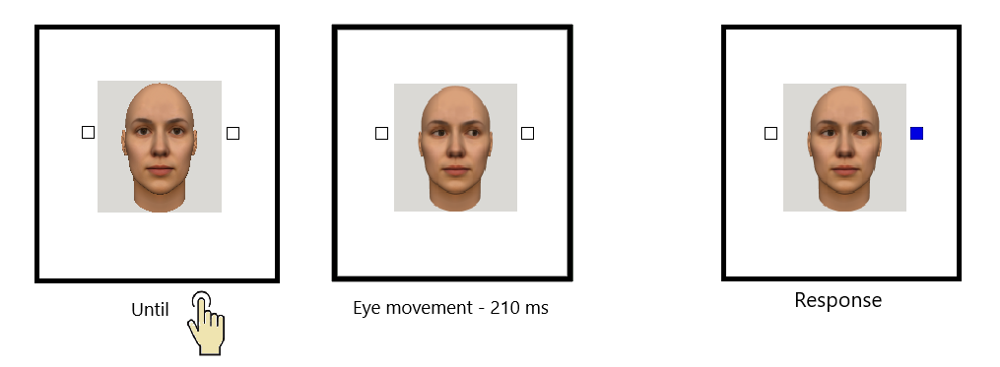

# Experiment 1

## Method

The first experiment follows the shared methodology and procedure described in the Rationale. In Experiment 1, the direction-selection response was made by keypress: participants indicated their intended direction by pressing a keyboard button corresponding to left or right (6 = right and 4 = left; in the counterbalanced version, d = right and a = left). Two button pairs were used across the two keypress tasks of the trial — a/d and 4/6 — and their assignment to the two tasks was counterbalanced across participants: for half of the participants, the target-discrimination response used the a/d pair while the direction-selection response used the 4/6 pair, and for the other half this assignment was reversed. The color-to-button (stimulus--response) mapping was likewise counterbalanced across participants.

The experiment lasted approximately 15-20 minutes.

### Participants

Fifty-five students took part in the experiment. Three were excluded due to technical issues encountered during data collection (session/equipment failure, or in one case accidental data loss) and are not present in the dataset, leaving data from 52 participants (14 males, 38 females; M = 22.76 years, SD = 5.78). Participants either volunteered or took part in exchange for course credit after providing written informed consent. To encourage task engagement, the number of credits awarded was contingent on performance accuracy. Participants received 4 ECTS credits for accuracy above 90%, 3 ECTS credits for accuracy above 80%, 2 ECTS credits for accuracy above 60%, and 1 ECTS credit for accuracy below 60%. All participants had normal or corrected-to-normal vision.

### Stimuli

The face stimulus that was used was generated by FaceGen program (FaceGen, n.d.). The face subtended around 13° of visual angle in height and 6° - in width, centered at the screen. From both sides of the face (5° to the nearest edge of the face) squares were presented subtending 3.5°, positioned at the eye central 'line'. Target colors were blue (Blue, RGB: 0, 0, 225) and green (Green, RGB: 0, 128, 0) filled in one of the squares as soon as the eye movement was completed. Figure 1. presents a trial example.

Stimuli presentation and response collection was controlled by E-prime 2.0 software (Schneider, Eschman, & Zuccolotto, 2002). Participants were tested individually in a sound-proof booth in front of 22-inch monitor with resolution of 1920x1080 pixels and refresh rate of 50 Hz. They were positioned at around 60 cm from the screen.

## Results and Discussion

**Data Exclusion and Final Sample**

Data were initially collected from 55 participants. Three participants were excluded (as mentioned above) due to technical issues encountered during data collection and are not present in the dataset, leaving data from 52 participants. Eight participants were excluded because their accuracy in the main experimental phase was below 85%, resulting in a sample of 44 participants, contributing a total of 7,392 trials.

Two further participants were excluded based on predefined questionnaire data-quality criteria: participants who showed invariant responding across items - defined as low response variance or straight-lining (i.e., 75% or more identical responses combined with a low condition-level response range) - were excluded, as such patterns are commonly interpreted as non-engaged or automated responding (Meade & Craig, 2012). This resulted in a sample of 42 participants, contributing 7,056 trials.

From these trials, 5.85% (413 trials) were removed as error trials, leaving 6,643 trials. Trials with a reaction time below 200 ms were then excluded as physiologically implausible for this task (13 trials, 0.20%, spread across 6 participants), leaving 6,630 trials. A further 4.74% (314 trials) were excluded because their remaining reaction times deviated by more than 2 standard deviations from the mean, calculated separately for each participant and condition, leaving 6,316 trials.

One further participant was excluded because their overall mean reaction time exceeded the group mean by more than 2 standard deviations (cutoff: 701.1 ms, participant's mean: 747.4 ms).

The final analyses were therefore conducted on data from 41 participants.

**Reaction Time, Gaze Cueing, and Sense of Agency**

**Descriptive statistics**

Descriptive statistics were computed for reaction times (RTs) in the main experimental phase as a function of gaze congruency (congruent vs. incongruent) and action consistency (consistent, inconsistent, control). Means and standard deviations for each condition are presented in Table X.

| Condition | Valid | Mean (ms) | SD | Min | Max |
|:---|:---:|:---:|:---:|:---:|:---:|
| Congruent – Consistent | 41 | 500.95 | 84.82 | 351 | 681 |
| Congruent – Control | 41 | 521.58 | 99.42 | 340 | 812 |
| Congruent – Inconsistent | 41 | 511.69 | 89.01 | 364 | 723 |

| Condition | Valid | Mean (ms) | SD | Min | Max |
|:---|:---:|:---:|:---:|:---:|:---:|
| Incongruent – Consistent | 41 | 515.98 | 83.22 | 374 | 693 |
| Incongruent – Control | 41 | 535.71 | 88.55 | 371 | 724 |
| Incongruent – Inconsistent | 41 | 516.68 | 80.33 | 344 | 665 |

Table X: Mean RTs and standard deviations (SD) per condition, ms.

Overall, reaction times tended to be faster in gaze-congruent than in gaze-incongruent trials, and faster in the active conditions than in control. The fastest responses were observed in the congruent-consistent condition (M = 500.95 ms, SD = 84.82), in which the selected direction, the gaze direction, and the target appearance were synchronized. The slowest responses were observed in the incongruent-control condition (M = 535.71 ms, SD = 88.55), where no target selection was made and the gaze moved to the side opposite the target.

The mean congruency effect (incongruent minus congruent, computed per participant) was 15.04 ms (SD = 27.55) for consistent trials, 14.13 ms (SD = 38.63) for control trials, and 4.99 ms (SD = 34.52) for inconsistent trials. Numerically, the effect was smallest in the inconsistent condition; 

Within gaze-congruent trials, RTs were fastest in the active conditions (M = 500.95 ms, SD = 84.82 for consistent; M = 511.69 ms, SD = 89.01 for inconsistent) relative to the control condition (M = 521.58 ms, SD = 99.42). A similar ordering held for gaze-incongruent trials (M = 515.98 ms, SD = 83.22 for consistent; M = 516.68 ms, SD = 80.33 for inconsistent; M = 535.71 ms, SD = 88.55 for control), again showing generally faster responses in the active conditions.

**Statistical analyses**

A post-hoc power analysis was conducted for the interaction between gaze congruency and action consistency. It indicated that with the final sample size (41 participants) our experiment had sufficient power to detect even a small effect (power = 0.942 for an effect size f = 0.20). The post-hoc power analysis was conducted using G\*Power 3.1.9.6 (Faul et al., 2007). To control for Type I error, whenever it was needed the degree of freedom was adjusted using the Greenhouse and Geisser (1959). Post-hoc tests of simple effects were performed using the Bonferroni correction with a significance level of p \< .05.

**rANOVA**

To compare reaction times across conditions, data were averaged by participant and entered into a repeated-measures ANOVA (rANOVA) with gaze congruency (congruent vs. incongruent) and action consistency (consistent, inconsistent, control) as within-subject factors. Bonferroni-corrected post hoc tests were applied where appropriate.

There was a significant main effect of gaze congruency, F(1, 40) = 14.25, p \< .001, η²ₚ = .263, that combined with the descriptive statistics indicated faster responses in gaze-congruent trials compared to gaze-incongruent trials, confirming a robust gaze-cueing effect.

Mauchly's test of sphericity indicated that the assumption of sphericity was violated for the action consistency factor (p \< .05); therefore, Greenhouse-Geisser-corrected degrees of freedom and results are reported for it. The main effect of action consistency also reached significance, although with smaller effect size F(1.45, 58.15) = 5.38, p = .014, η²ₚ = .119, suggesting that reaction times differed across action-consistency conditions. To further explore this effect, Bonferroni-corrected pairwise comparisons were conducted, collapsed across gaze congruency. Reaction times were significantly faster in the consistent condition than in the control condition (MD = −20.18 ms, t(40) = −2.90, p = .018, Cohen's d = −0.23). Consistent and inconsistent trials did not differ significantly (MD = −5.72 ms, t(40) = −1.43, p = .481), nor did inconsistent and control trials (MD = −14.46 ms, t(40) = −1.93, p = .183). 

Importantly, the interaction between gaze congruency and action consistency was not significant, F(1.98, 79.38) = 1.09, p = .341, η²ₚ = .027, indicating that the magnitude of the gaze-cueing effect did not differ as a function of action consistency. 
An exploratory Bonferroni-corrected post hoc on the interaction was also conducted. It indicated that the CG effect was significant within the consistent condition (MD = 15.04 ms, SE = 4.30, t(40) = 3.50, p = .001, Cohen's d = 0.18) and significant within the control condition (MD = 14.13 ms, SE = 6.03, t(40) = 2.34, p = .024, Cohen's d = 0.15), meaning that in both the consistent and control conditions participants reacted significantly faster when the target appeared on the gazed-at side compared to the opposite side. In the inconsistent condition, however, although the same pattern of faster reactions for the gazed-at target direction was preserved numerically, it did not reach significance (MD = 4.99 ms, SE = 5.39, t(40) = 0.93, p = .360, Cohen's d = 0.06).
Regarding the Gaze × Action interaction, a statistically significant difference was observed only between the consistent-congruent and control-congruent conditions, with consistent faster (MD = −20.63 ms, t(40) = −2.57, p = .042, Cohen's d = −0.24), and between the consistent-incongruent and control-incongruent conditions, again with consistent faster (MD = −19.72 ms, t(40) = −2.56, p = .044, Cohen's d = −0.23). No other pairwise comparison reached significance.

**ANCOVA Results**

As mentioned in the chapter (add number) Rationale, action initiation time (or the corresponding pre-gaze interval in the control condition) was measured and included as a covariate to account for variability in the interval between initial face presentation and direction selection response. In the action conditions, this interval may reflect prospective action-related processes, such as intention formation, action preparation, motor readiness, and prediction of the expected action outcome. Accordingly, a repeated-measures ANCOVA was conducted with mean-centered action initiation time as a covariate. Mean-centering ensured that the model's lower-order effects were evaluated at a typical participant's initiation time rather than at the uninterpretable value of zero.

Controlling for action initiation time did not change the overall pattern of results. A significant main effect of Gaze remained, F(1, 39) = 13.91, p \< .001, η²ₚ = .263, indicating faster responses on congruent than incongruent trials. The main effect of Action also remained significant, F(1.55, 60.33) = 6.22, p = .007, η²ₚ = .137. Importantly, the Gaze × Action interaction remained non-significant, F(2, 78) = 1.13, p = .330, η²ₚ = .028, indicating that controlling for initiation time did not reveal evidence that action-outcome consistency modulated the gaze-cueing effect.

As a side note, the Action × covariate (initiation time) interaction did reach significance, F(1.55, 60.33) = 7.24, p = .003, η²ₚ = .157. However, because the control condition did not involve an action discrimination task, the corresponding pre-gaze interval does not represent action initiation in the same sense as in the active conditions; the covariate was included solely to reduce variance associated with the timing preceding gaze onset. This interaction's significance is therefore more plausibly a statistical artefact and should not be interpreted theoretically.

**Correlation**

Pearson correlation analyses were conducted among the six RT cells and action initiation time. Reaction times across all gaze congruency and action consistency conditions were strongly and positively correlated with one another (rs = .81–.95, all ps \< .001), indicating stable individual differences in general response speed across conditions.

Action initiation time correlated only weakly and inconsistently with RT: two of the six cells reached significance (congruent-control, r = .35, p = .027; incongruent-control, r = .37, p = .018), while the remaining four did not (r = .10–.23, all p \> .15).

Overall, the standard gaze-cueing effect was present (faster RTs for congruent trials), and the action main effect was also present, with active trials faster than control. However, action-outcome consistency did not modulate gaze cueing — the Gaze × Action interaction was non-significant. Action and gaze cueing behaved as independent modulators of RT.

**Questionary data**

**Descriptives**

The three questions used to measure explicit sense of agency were answered on a seven-point Likert scale, ranging from 1 ("I completely disagree") to 7 ("I completely agree"). Descriptive statistics for all questionnaire items across the three action-consistency conditions are presented in Table X.

| Question type | Consistent (M ± SD) | Inconsistent (M ± SD) | Control (M ± SD) | Overall (M ± SD) |
|:--------------|:--------------------:|:-----------------------:|:-------------------:|:-------------------:|
| Caused        | 5.75 ± 1.17          | 4.47 ± 1.96              | 1.74 ± 1.10          | 3.96 ± 0.93          |
| Controlled    | 4.41 ± 1.78          | 2.39 ± 1.36              | 1.53 ± 0.89          | 2.77 ± 0.92          |
| Predicted     | 4.86 ± 1.49          | 2.74 ± 1.39              | 2.63 ± 1.29          | 3.39 ± 0.99          |
| Overall       | 4.98 ± 1.18          | 3.20 ± 1.16              | 1.95 ± 0.90          | 3.38 ± 0.65          |

Table X. Mean point results from Questionary data by condition and item (question)

**Analyses**

[G*Power analysis for this ANOVA to be added.]

To formally test whether the three question types responded differently to the action-consistency manipulation, ratings were submitted to a 3 (Question type: caused, controlled, predicted) × 3 (Action Consistency: consistent, inconsistent, control) repeated-measures ANOVA, with Greenhouse–Geisser correction applied to all within-subject terms with more than one degree of freedom.

The ANOVA revealed a significant main effect of Action Consistency, *F*(1.84, 73.74) = 82.56, *p* \< .001, η²ₚ = .674: participants reliably distinguished between the consistent, inconsistent, and control conditions in how they answered all three sense-of-agency questions. Post hoc comparisons indicated that ratings were highest overall in the consistent condition (M = 4.98), differing from both the inconsistent condition (MD = 1.19) and the control condition (MD = 3.02). Ratings were next-highest in the inconsistent condition — the other active condition, where action-outcome consistency was nonetheless violated (M = 3.20) — significantly differing from the control condition by 1.25 points. As expected, the lowest ratings were observed in the control condition (M = 1.95).

A significant main effect of Question type was also observed, *F*(1.70, 68.10) = 20.61, *p* \< .001, η²ₚ = .340. A post hoc comparison showed that each of the three questions differed significantly from the other two in overall level of endorsement. The simple main effect of Action Consistency, examined within each item, was significant for all three questions but far from equal in size: causation showed the largest effect (*F*(2, 80) = 89.23, *p* \< .001, η²ₚ = .690), followed by control (*F*(2, 80) = 55.84, *p* \< .001, η²ₚ = .583), with prediction showing the smallest effect (*F*(2, 80) = 46.32, *p* \< .001, η²ₚ = .537).

These two effects were qualified by a significant Action Consistency × Question type interaction, *F*(2.32, 92.86) = 26.26, *p* \< .001, η²ₚ = .396. Post hoc comparisons conditional on the interaction were then examined.
Conditional on action consistency, post hoc comparisons showed that within both active conditions — consistent and inconsistent — the highest-rated item, causation, differed significantly from both prediction (rated second) and control (rated lowest), while prediction and control did not differ significantly from each other. In the control (non-active) condition, the pattern reversed: prediction was rated highest, differing significantly from both causation (rated second) and control (rated lowest), while causation and control did not differ from each other. In other words, causation and prediction swapped ranks between the active and control conditions, while control remained the lowest-rated item throughout. This pattern suggests that the three questions may be capturing different domains, since they differ significantly from one another even within the same condition.
Regarding the items' sensitivity to discriminate between conditions, a second post hoc, conditioned on question type, was conducted. For all items, ratings were highest in the consistent condition, followed by inconsistent and then control. Each item showed a significant difference between all three action conditions, with the exception of the prediction item, which did not discriminate significantly between the inconsistent and control conditions — suggesting that the mismatch between action and outcome distorted the prediction item to the point where it no longer differed from the condition in which no action was executed at all.

Together, the two decompositions support the same conclusion from complementary angles: the action-consistency manipulation reliably shifted ratings on all three questions (with causation showing the strongest, and prediction the weakest, sensitivity to consistency), and the three questions were not entirely interchangeable even within a single condition — suggesting that causation, prediction, and control tap related but separable components of explicit sense of agency.

**Combining the three items into a single explicit-SoA score**

The item-level correlations above show that caused, controlled, and predicted are related but not interchangeable, which raises the question of how to relate the questionnaire data to RT as a single explicit index rather than three separate ones. The three items were therefore averaged per condition into a composite score (mean of caused, controlled, predicted), which a principal component analysis confirmed loads onto a single component in every condition, supporting a simple unweighted average over a weighted one.

A raw composite of this kind, however, is sensitive to individual differences in how participants anchor the rating scale — some participants rate every condition low, others rate every condition high, independent of the manipulation itself. To separate this general response-style bias from the condition-specific variation the manipulation is meant to produce, composite (and single-item) scores were additionally submitted to within-person centering — also referred to as ipsatization in the individual-differences literature (Cattell, 1944; Hicks, 1970) — in which each participant's own mean across their three conditions is subtracted from each of their condition scores. Centering stopped at subtracting the mean; it did not extend to also dividing by each participant's own standard deviation (full ipsatization), since that would be estimated from only three repeated values per participant (an unstable estimate) and would force every participant's between-condition spread to the same size by construction, erasing individual differences in the *magnitude* of the condition effect — precisely the quantity of interest for relating explicit ratings to the size of the implicit RT effect.

**Correlation**

Regarding the questionnaire measures, the **controlled** and **predicted** items correlated strongly and significantly with each other within every action-consistency condition (consistent: r = .69, p \< .001; control: r = .50, p \< .001; inconsistent: r = .74, p \< .001). The **caused** item's relationship with the other two was less consistent: it correlated strongly with **controlled** in the control condition (r = .81, p \< .001) but only marginally in the consistent condition (r = .30, p = .056) and not at all in the inconsistent condition (r = .19, p = .245); its correlation with **predicted** was weak and non-significant in all three conditions (r = .28 to −.07, all p \> .07). This pattern suggests that while **controlled** and **predicted** track a shared construct of explicit sense of agency fairly consistently, **caused** captures something more distinct, particularly outside the control condition -- supporting the items' discriminant validity, though less uniformly than a single shared "explicit SoA" factor would predict.

Reaction times and questionnaire measures were almost entirely uncorrelated, with two exceptions: the **inconsistent_control** item (the control-condition "controlled" rating) correlated with the congruent-control RT cell (r = .36, p = .020) and the incongruent-inconsistent RT cell (r = .31, p = .047). Both are nominally significant but uncorrected across the 54 RT-by-questionnaire comparisons tested, and involve control-condition and inconsistent-condition cells that are conceptually distant from each other, so they read as plausible chance findings rather than a systematic RT-SoA relationship. The remaining 52 of 54 comparisons were non-significant, consistent with implicit (RT) and explicit (rating) measures of sense of agency being largely dissociated, as in Experiments 2 and 3.

## Discussion

**Questionary items and explicit SoA measurements**

The results from the three questionnaire items consistently demonstrated that the experimental manipulation of sense of agency through action--outcome consistency was effective. Across all three items, participants reliably differentiated between the three action-consistency conditions, showing higher explicit agency ratings in the active conditions (consistent and inconsistent) and the lowest ratings in the control condition, in which no action was performed.

The pronounced difference between the active and passive conditions is theoretically expected. In the active conditions, participants were required to choose a direction, thereby actively engaging in decision-making. This engagement in voluntary (free) choice is known to enhance the SOA (Barlas & Obhi, 2013; Beck et al., 2017). This likely induced a greater degree of intentionality in their actions, which is also considered a key prerequisite of the SOA (Haggard et al., 2002; Minohara et al., 2016). More over in the active conditions participants executed a voluntary motor movement (button press), accompanied by tactile feedback. Motor execution, sensory feedback are also widely regarded as core prerequisites for the experience of sense of agency (Antusch et al., 2021; Engbert et al., 2008).

In contrast, in the control condition, gaze movements were externally generated therefor no intentionality was present, no motor action was required, resulting in minimal agency ratings. This active--passive contrast aligns with extensive evidence showing that agency is strongly attenuated or absent when outcomes are not linked to one's own actions (Engbert et al., 2008; Haggard et al., 2002) (Moore & Fletcher, 2012).

Focusing on the two active conditions, explicit agency ratings were consistently higher in the consistent than in the inconsistent condition. This pattern is likewise expected, as the inconsistent condition involved a violation of participants' action-based expectations: although an action was executed, the resulting gaze movement did not match the intended direction. Such violations are known to reduce the sense of agency by introducing prediction errors between intended and observed outcomes (cite AofA_predictions). Importantly, this effect is predicted by all dominant theoretical accounts of sense of agency.

Another perspective can be given if we examine the individual item patterns. The three questions showed both convergence and differentiation. While all items were sensitive to the manipulation of agency, they showed distinct rating patterns and inter-item relationships, suggesting that they capture overlapping but non-identical aspects of explicit sense of agency, pointing to a more nuanced internal structure of explicit SoA.

Across both active conditions, a highly consistent ordering of ratings was observed, with perceived causation receiving the highest ratings, followed by prediction, and perceived control receiving the lowest ratings (caused \> predicted \> controlled). This stable hierarchy suggests that explicit agency judgments were primarily anchored in perceived causation---that is, the extent to which participants felt they had brought about the observed outcome. Such a pattern aligns with theoretical accounts emphasizing the difference between the sense of initiation and sense of control (Pacherie, 2007).

Interestingly, prediction and control appeared to play a secondary role. In the control condition, the prediction item was rated relatively higher than the other two items, despite the absence of action. This finding may reflect the fact that prediction judgments do not necessarily require self-generated action, but can instead be based on anticipatory or inferential processes regarding upcoming events.

In contrast, perceived control was consistently rated lowest across all conditions, including the control condition. This may reflect the semantic strength of the control formulation, which arguably implies intentional continuous intervention and direct influence over the outcome (Pacherie, 2007). In the absence of continuous action, such a strong sense of control is unlikely to be endorsed. Moreover, linguistic factors may have contributed to this pattern: in Bulgarian, the phrasing of the control item may convey a particularly strong or absolute sense of control, leading participants to respond more conservatively. Such effects of item wording and semantic strength on agency judgments have been noted in previous research (Bart et al., 2019; Simchon et al., 2023).

The conducted correlational analyses further support a multidimensional interpretation of explicit sense of agency. While the causation item did not correlate significantly with either prediction or control, prediction and control showed a moderate positive correlation, an effect that remained after z-standardization of the questionnaire scores. One possible interpretation is that prediction and control judgments rely on more abstract, less outcome-specific representations of agency, whereas causation judgments are more tightly linked to concrete action--effect attribution. In other words, causation may reflect a more categorical judgment of responsibility for an outcome, whereas prediction and control capture more graded, temporally distributed aspects of agency, relating to anticipatory (future-oriented) and regulatory (present-oriented) processes, respectively.

The present findings support contemporary theoretical accounts proposing that explicit sense of agency is a multidimensional construct rather than a unitary experience (Dewey & Knoblich, 2014; Pacherie, 2007) (I need to cite more?). Across all conditions, participants systematically distinguished between causation, prediction, and control, with perceived causation emerging as the most salient component of agency in action-based trials. This pattern aligns with multifactorial models of agency, which emphasize that explicit agency judgments integrate multiple cues, including outcome attribution, predictive signals, and intentional control (Pacherie, 2007) (I need to cite more?).

The consistently higher ratings for the causation item (or the filing of initiation) are in line with theories highlighting perceived causation as a core determinant of conscious agency (Pacherie, 2007). At the same time, the differential effect sizes across items and the selective correlations between predicted and controlled judgments indicate that these measures are not redundant. Instead, they appear to capture partially distinct components of agency, supporting their discriminant validity (Dewey & Knoblich, 2014). Taken together, these results suggest that explicit sense of agency is best conceptualized as a structured set of related judgments rather than a single scalar experience, with different components being differentially weighted depending on task demands and action--outcome contingencies.

**Behavioral results and RTs**

The descriptive results indicate that the paradigm successfully elicited a gaze cueing effect (GCE), as participants responded faster in gaze-congruent trials than in incongruent trials. This finding confirms that the modified task preserved the core attentional orienting mechanism originally described in the gaze cueing literature (Driver et al., 1999; Friesen & Kingstone, 1998). Thus, the experimental manipulation was effective in engaging reflexive attentional shifts based on observed gaze direction.

This suggests that performing an action prior to target onset facilitated subsequent processing. One explanation relates to motor preparation and its interaction with attention. Research has shown that preparing an action can bias attentional allocation toward task-relevant dimensions and facilitate subsequent perceptual processing (Fagioli, Hommel, & Schubotz, 2007). Similarly, motor preparation has been linked to enhanced processing of expected stimuli through predictive mechanisms (Brown et al., 2011). In this sense, action execution may not merely add cognitive load, as suggested by classical dual-task accounts (Pashler, 1994), but may instead prime attentional systems when action and perceptual events are temporally and structurally linked.

At the level of specific conditions, participants were slowest in the incongruent-control condition. This condition combined the absence of voluntary action with invalid gaze cueing, thereby providing neither predictive motor information nor valid attentional guidance. Conversely, participants were fastest in the congruent-consistent condition, where gaze direction, action intention, and target location were fully aligned. This convergence likely maximized both attentional facilitation and action--outcome consistency, resulting in optimal performance.

Beyond the classic GCE, reaction times were overall faster in active trials (both consistent and inconsistent) compared to control trials, in which no action was required. Because the temporal interval between the action-initiation button press and target onset was held constant---more specifically, 210 ms (Figure ...)---this effect cannot be attributed to differences in stimulus timing. Instead, it likely reflects enhanced prediction and expectancy of the upcoming target in the active conditions. If we follow the established findings from classical dual-task studies, one would typically expect performance costs when multiple cognitive or motor demands are combined. In other words, the requirement to press a button before the target appears could be expected to slow down the subsequent target categorization response. However, our results reveal the opposite pattern, which may indicate that action planning is closely linked to the allocation of attention. In support of this interpretation, Fagioli, Hommel, and Schubotz (2007) directly tested whether preparing an action biases perceptual processing. They compared preparation for reaching and grasping movements. While participants maintained the action plan (prior to execution), they were presented with stimuli varying in perceptual features such as location or size. The central question was whether preparing a specific type of movement facilitates processing of stimulus dimensions relevant to that movement. The results showed that when participants prepared a reaching action, they detected changes in location-based stimuli more quickly. Conversely, when preparing a grasping action, they detected changes in size-based stimuli more quickly. In other words, even planning an action---before its actual execution---biased perception toward action-related stimulus dimensions, demonstrating intentional control over attentional allocation (Fagioli et al., 2007).

{width="4.214285870516186in" height="1.5483891076115486in"}

Participants were slowest in the incongruent-control condition, which, according to the experimental design, should neither produce a valid gaze cueing effect nor elicit a strong sense of agency. Indeed, this condition was also associated with the lowest explicit agency ratings in the questionnaire phase. In contrast, participants responded fastest in the congruent-consistent condition, where both gaze cueing and action--outcome consistency were present.

One possible explanation for this pattern relates to the link between motor preparation and attentional allocation. Brown et al. examined how motor preparation and attention interact during movement planning and execution. Using a reaction-time paradigm similar to a Posner cueing task, they tested whether cues about an upcoming movement would facilitate responses. Their results showed that valid movement cues led to faster reaction times compared to invalid cues.

An important difference, however, is that in Brown et al.'s study participants were explicitly instructed about cue validity, whereas in the present study participants selected the gaze direction themselves. It is therefore possible that the internally generated decision about movement direction functioned as an internal cue, facilitating faster responses in the congruent-consistent condition.

At the same time, the congruent-consistent condition was also associated with the highest explicit sense of agency ratings in the questionnaire phase. This suggests a potential convergence between attentional facilitation and subjective agency experience when action intentions and perceptual outcomes are aligned. Therefore, the fastest reaction times in this condition cannot be attributed solely to motor preparation. The possible contribution of sense of agency to this facilitation effect warrants further investigation.
