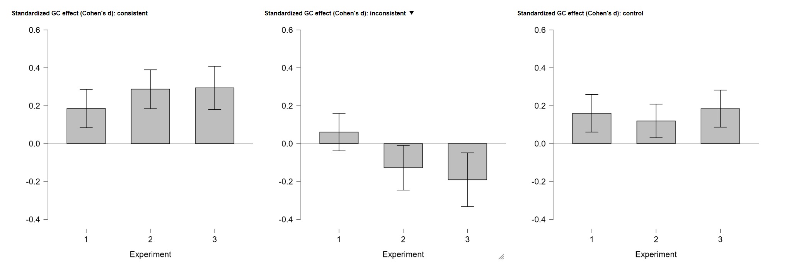

# Cross-Experiment RT Analysis — Results

Because the three experiments differed in the modality of the direction-selection response (keypress, mouse click, touchscreen tap), the data from all three experiments were combined into a single cross-experiment analysis, with `Experiment` entered as a between-subjects factor (N = 41, 48, 49 for Experiments 1–3; N = 138 total). This made it possible to test whether response modality moderates how gaze congruency and action consistency interact.

A post-hoc power analysis, with experiment entered as a between-subjects factor (G\*Power 3.1.9.6), confirmed high power (power = 0.935) for the current sample (*N* = 138) to detect a medium effect (*f* = 0.25); as in the individual experiments, Greenhouse–Geisser correction and Bonferroni-corrected post hoc comparisons were applied wherever needed.

## Mixed ANOVA (raw RT)

To determine whether response action modality influenced the relationship between action-outcome consistency and gaze cueing, we first performed a mixed 2 (Gaze Congruency) × 3 (Action Consistency) × 3 (Experiment as between factor) mixed ANOVA on raw reaction times, Greenhouse–Geisser corrected throughout. The results showed that the three-way interaction — the direct test of whether response modality changes the relationship between gaze congruency and action consistency — approaches but does not reach conventional significance, F(3.76, 253.95) = 2.33, p = .061.

| Term | Result |
|---|---|
| Experiment (between) | F(2, 135) = 0.04, p = .965 (n.s.) |
| Gaze | F(1, 135) = 44.74, p < .001, η²ₚ = .249 |
| Gaze × Experiment | F(2, 135) = 0.06, p = .939 (n.s.) |
| Action | F(1.41, 190.79) = 20.20, p < .001, η²ₚ = .130 |
| Action × Experiment | F(2.83, 190.79) = 1.24, p = .298 (n.s.) |
| Gaze × Action | F(1.88, 253.95) = 22.00, p < .001, η²ₚ = .140 |
| **Gaze × Action × Experiment** | F(3.76, 253.95) = 2.33, **p = .061** (marginal) |

Post hoc tests decomposing the marginal three-way interaction (conditional on gaze and on action) showed the same pattern as before: the congruency effect was present in consistent and control trials but not in inconsistent trials, in all three experiments. However, no comparison between experiments reached significance, likely because comparing raw RT across independent samples involves much larger error (SE ≈ 18–20 ms). We therefore used a standardized effect-size measure (Cohen's d), which is less sensitive to this noise, to test more directly for modality differences.

## Standardized GC-effect analysis (Cohen's d)

To maximally rule out noise in individual RT data, we calculated Cohen's d per subject as a direct, standardized measure of the gaze-cueing (congruency) effect within each action condition (each subject's own congruent- and incongruent-trial RTs pooled into one SD, then the mean difference divided by it) and submitted this to a 3 (condition) × 3 (Experiment) ANOVA.

| Term | Result |
|---|---|
| d (main effect) | F(1.84, 247.74) = 31.15, p < .001, η²ₚ = .187 |
| **d × Experiment** | F(3.67, 247.74) = 3.28, **p = .015**, η² = .029, η²ₚ = .046 |
| Experiment (collapsed across condition) | 0/3 pairwise comparisons significant (all p ≥ .925) |

The interaction between the standardized GC effect and experiment (modality of the movement) reached significance, F(3.67, 247.74) = 3.28, p = .015, however with a small effect size (η²ₚ = .046). The simple main effect of experiment showed a significant difference only in the inconsistent condition (F(2, 135) = 4.25, p = .016), whereas no significant difference was observed for consistent (F(2, 135) = 1.51, p = .226) or control (F(2, 135) = 0.52, p = .597).

Post hoc comparisons on this interaction were conducted. Conditional on Experiment (comparing action conditions within each experiment) and conditional on action condition (comparing experiments within each action level). Conditional on Experiment: within Experiment 1, none of the three action-condition comparisons reached significance (cons vs. incons, *p* = .512; cons vs. ctrl, *p* = 1.000; incons vs. ctrl, *p* = .699). Within Experiment 2, all three were significant (cons vs. incons, *d* = 1.160, *p* \< .001; cons vs. ctrl, *d* = 0.469, *p* = .029; incons vs. ctrl, *d* = −0.691, *p* = .005). Within Experiment 3, two of three were significant (cons vs. incons, *d* = 1.356, *p* \< .001; incons vs. ctrl, *d* = −1.050, *p* \< .001; cons vs. ctrl, *d* = 0.307, *p* = .255, n.s.). Conditional on action condition: consistent and control never differed significantly between any pair of experiments (all *p* ≥ .354), while inconsistent trials showed a significant Experiment 1 vs. Experiment 3 difference (*d* = 0.703, *p* = .016) and a trend between Experiment 1 and Experiment 2 (*p* = .110).

Taken together with the raw-RT results, all of these analyses point in the same direction: Experiment 1 shows no action-consistency effect on the standardized GC measure at all, while Experiments 2 and 3 both show a strong one (led by the inconsistent condition in Experiment 3). In other words, all of these analyses point in the same direction: if response modality changes the gaze-cueing effect at all, that difference is located most likely in the inconsistent condition. 

