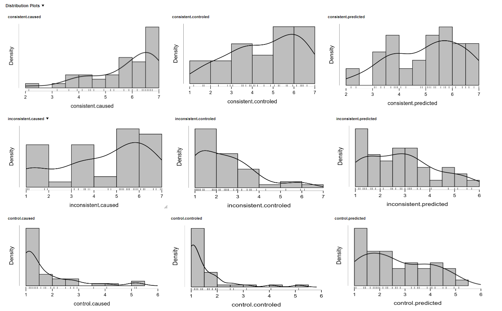

# Experiment 1

## Method

The first experiment employed a within-subjects design with two factors: gaze congruency and action consistency. The procedure consisted of three phases: a practice phase, the main experimental phase, and a questionnaire phase. The practice phase was identical to the main experimental phase and served to familiarize participants with the task.

During both the practice and experimental phases, the independent variables were manipulated as follows. The gaze congruency factor had two levels: congruent, when the gaze was oriented toward the target position, and incongruent, when the gaze was oriented in the opposite direction. Action consistency referred to the relationship between the participant's intended action direction and the actual direction of gaze---that is, whether the gaze followed the direction chosen by the participant. This factor comprised three levels: control, for trials in which no directional choice was required; consistent, when the gaze was aligned with the participant's chosen direction; and inconsistent, when the gaze was oriented opposite to the participant's chosen direction.

As a final part of the procedure, explicit sense of agency was assessed using self-report questions. Participants were asked to indicate the extent to which they felt they controlled, caused, or predicted the gaze movements.

### Procedure

Participants were first informed about the experimental instructions. The experiment began with a practice phase equivalent to the main experimental procedure. Given the complexity of the design, the practice phase was included to ensure that participants fully understood the task requirements. The practice phase consisted of 20 trials, and data from these trials were not included in the analyses.

Following the practice phase, the instructions were presented again, after which participants completed the main experimental phase. In this phase, participants performed two consecutive tasks within each trial.

First, to induce a sense of agency, participants performed the **direction-selection response**: they were asked to select the direction of the upcoming gaze movement before it occurred, indicating their intended direction by pressing a keyboard button corresponding to left or right (6 = right and 4 = left; in the counterbalanced version, d = right and a = left). In two-thirds of the trials (referred to as active trials), participants actively selected the gaze direction by pressing a button. In half of these trials, the gaze direction matched the participant's choice (consistent trials), whereas in the other half it moved in the opposite direction (inconsistent trials). In the remaining one-third of the trials (control trials), no directional choice was required and no button was pressed; gaze direction in these trials was randomly determined, with equal probability of moving left or right.

The direction-selection response was followed by a modified version of the standard gaze-cueing paradigm (Friesen \& Kingstone, 1998; Driver et al., 1999). In the standard paradigm, a face is presented at the center of the screen and shifts its gaze to the left or right, after which a target appears on one side of the screen. In the present experiment, a centrally presented face was accompanied by two rectangles positioned on either side. After the gaze movement ended, one of the rectangles (the target) changed color to either green or blue. Participants were instructed to perform the **target-discrimination response**: a color discrimination task completed by pressing a response button. Two button pairs were used across the two keypress tasks of the trial — a/d and 4/6 — and their assignment to the two tasks was counterbalanced across participants: for half of the participants, the target-discrimination response used the a/d pair while the direction-selection response used the 4/6 pair, and for the other half this assignment was reversed. The color-to-button (stimulus--response) mapping was likewise counterbalanced across participants. Only the direction-selection response's modality changes across the three experiments (keypress in Experiment 1, mouse movement in Experiment 2, touchscreen pointing in Experiment 3 — see the respective Method sections for details); in Experiments 2 and 3, where the direction-selection response was no longer a keypress, the target-discrimination response was always given using the a/d button pair, with no button-pair counterbalancing.

Each trial proceeded as follows:

1\. A fixation symbol appeared at the center of the screen for 1 s: a cross ("+") or an asterisk ("\*"), one signaling a control trial (no action required) and the other signaling an active trial, in which the participant was required to give the direction-selection response. The assignment of symbol to trial type was counterbalanced across participants.

2\. The face was then presented looking straight ahead. In control trials, the face remained on screen for a random duration between 350 and 550 ms. In active trials, the face remained until the participant gave the direction-selection response; the interval between face onset and this response constitutes the **initiation time**, later used as an ANCOVA covariate (see ANCOVA Results).

3\. The gaze movement then began and lasted 210 ms, consisting of seven successive frames with slight pupil shifts (each presented for 30 ms) to create a smooth and continuous gaze movement. The gaze could be either congruent or incongruent with the target location.

4\. Immediately after the gaze movement ended, the target appeared: one of the two rectangles changed color to green or blue. The target remained on screen for up to 3 s or until the target-discrimination response was made. If no response was given within this interval, the fixation symbol reappeared and the next trial began.

5\. At the end of the trial an inter-trial interval of 1 s was presented.

Figure 1: Trial timeline examples (not to scale).\
a) Control condition (passive expectation of face appearance), incongruent gaze cuing;\
b) and c) participants induce face appearance with a button press, choosing gaze direction, b) -- congruent gaze cuing, c) -- incongruent gaze cuing.\
During the response window participants discriminate between colors.\
ITI -- intertrial interval.

{width="6.335821303587052in" height="4.2219444444444445in"}

The main experimental phase consisted of 168 trials (28 trials per condition). Trials were presented in a pseudorandom order, such that no more than two consecutive trials shared the same condition or target color.

The final phase of the experiment was designed to measure the explicit sense of agency. Similar to previous studies (e.g., Sato & Yasuda, 2005; Wenke, Fleming & Haggard (2010); Dewey & Knoblich (2014)), explicit agency in the present experiment was measured using self-report ratings capturing perceived causation, prediction, and control over the observed effects. The exact questions that were asked in Bulgarian are:

- До колко смятате, че предвидихте посоката на движение на погледа?

- До колко смятате, че контролирахте посоката на движение на погледа?

- До колко смятате, че предизвикахте посоката на движение на погледа?

This phase replicated the action-induction task from the main experimental phase but this time the gaze movement was followed by three self-report questions presented in random order. The questions were answered using a 7-point Likert scale ranging from 1 ("Strongly disagree") to 7 ("Strongly agree"), with responses entered via the numeric keypad. The scale, along with its verbal anchors, was displayed on the screen together with each question.

The response options were defined as follows:

1 -- Strongly disagree (изобщо не смятам);

2 -- Disagree (не смятам);

3 -- Somewhat disagree (по-скоро не смятам);

4 -- Neither agree nor disagree (колкото смятам, толкова и не смятам);

5 -- Somewhat agree (по-скоро смятам);

6 -- Agree (смятам);

7 -- Strongly agree (напълно смятам);

As in the previous phase, this task included three levels of the action consistency factor: control (no action required), consistent (gaze followed the participant's chosen direction), and inconsistent (gaze moved opposite to the participant's chosen direction). The timing of the fixation symbol, gaze movement, and inter-trial interval was identical to that of the main experimental phase. This phase consisted of 48 trials (16 trials per condition).

The experiment lasted approximately 15-20 minutes.

### Participants

Fifty-five students took part in the experiment. Three were excluded due to technical issues encountered during data collection (session/equipment failure, or in one case accidental data loss) and are not present in the dataset, leaving data from 52 participants (14 males, 38 females; M = 22.76 years, SD = 5.78). Participants either volunteered or took part in exchange for course credit after providing written informed consent. To encourage task engagement, the number of credits awarded was contingent on performance accuracy. Participants received 4 ECTS credits for accuracy above 90%, 3 ECTS credits for accuracy above 80%, 2 ECTS credits for accuracy above 60%, and 1 ECTS credit for accuracy below 60%. All participants had normal or corrected-to-normal vision.

### Stimuli

The face stimulus that was used was generated by FaceGen program (FaceGen, n.d.). The face subtended around 13° of visual angle in height and 6° - in width, centered at the screen. From both sides of the face (5° to the nearest edge of the face) squares were presented subtending 3.5°, positioned at the eye central 'line'. Target colors were blue (Blue, RGB: 0, 0, 225) and green (Green, RGB: 0, 128, 0) filled in one of the squares as soon as the eye movement was completed. Figure 1. presents a trial example.

Stimuli presentation and response collection was controlled by E-prime 2.0 software (Schneider, Eschman, & Zuccolotto, 2002). Participants were tested individually in a sound-proof booth in front of 22-inch monitor with resolution of 1920x1080 pixels and refresh rate of 50 Hz. They were positioned at around 60 cm from the screen.

## Results

**Data Exclusion and Final Sample**

Data were initially collected from 55 participants. Three participants were excluded due to technical issues encountered during data collection and are not present in the dataset, leaving data from 52 participants. Eight participants were excluded because their accuracy in the main experimental phase was below 85%, resulting in a sample of 44 participants, contributing a total of 7,392 trials.

Two further participants were excluded based on predefined questionnaire data-quality criteria: participants who showed invariant responding across items---defined as low response variance or straight-lining (i.e., 75% or more identical responses combined with a low condition-level response range)---were excluded, as such patterns are commonly interpreted as non-engaged or automated responding (Meade & Craig, 2012). This resulted in a sample of 42 participants, contributing 7,056 trials.

From these trials, 5.85% (413 trials) were removed as error trials, leaving 6,643 trials. Trials with a reaction time below 200 ms were then excluded as physiologically implausible for this task (13 trials, 0.20%, spread across 6 participants), leaving 6,630 trials. A further 4.74% (314 trials) were excluded because their remaining reaction times deviated by more than 2 standard deviations from the mean, calculated separately for each participant and condition, leaving 6,316 trials.

One further participant was excluded because their overall mean reaction time exceeded the group mean by more than 2 standard deviations (cutoff: 701.1 ms, participant's mean: 747.4 ms).

The final analyses were therefore conducted on data from 41 participants.

**Questionary data**

**Descriptives**

The three questions used to measure explicit sense of agency were answered on a seven-point Likert scale, ranging from 1 ("I completely disagree") to 7 ("I completely agree"). Descriptive statistics for all questionnaire items across the three action-consistency conditions are presented in Table X.

Overall, participants reported the highest ratings in the **consistent** condition, followed by the **inconsistent** condition, while the **control** condition received the lowest ratings across all three questions. Specifically, in the consistent condition, mean ratings were highest for the *causation* item (M = 5.75, SD = 1.17), followed by *prediction* (M = 4.86, SD = 1.49) and *control* (M = 4.41, SD = 1.78). In the inconsistent condition, ratings were lower overall, with means of 4.47 (SD = 1.96) for *causation*, 2.74 (SD = 1.39) for *prediction*, and 2.39 (SD = 1.36) for *control*. The lowest ratings were observed in the control condition, where mean scores ranged from 1.53 (SD = 0.89) for *control* to 2.63 (SD = 1.29) for *prediction*.

This pattern indicates higher levels of explicit sense of agency in trials in which participants actively selected an action outcome (consistent and inconsistent conditions), with the strongest evidence of explicit SOA observed when the gaze movement followed the participant's intended direction. In other words, the consistent condition was associated with the highest ratings across all three questions, whereas the control condition consistently yielded the lowest ratings, indicating a clear differentiation between action-generated and externally generated gaze movements.

Importantly, this distribution of ratings is in line with the experimental expectations and suggests that the manipulation of explicit sense of agency was successful.

Regarding question type (item) -- similar pattern was observed in both active conditions. In the consistent and inconsistent conditions, the *causation* item received the highest ratings, followed by the *prediction* item, whereas the *control* item was rated lowest. In the control condition, ratings for the *control* item were likewise low, indicating a consistently reduced sense of intentional control when no action was performed. This consistent ordering across conditions suggests that the three questions captured related but distinct aspects of explicit sense of agency, with perceived causation being the most salient component across action-based trials.

| Question type | Consistent (M ± SD) | Inconsistent (M ± SD) | Control (M ± SD) |
|:--------------|:--------------------:|:-----------------------:|:-------------------:|
| Caused        | 5.75 ± 1.17          | 4.47 ± 1.96              | 1.74 ± 1.10          |
| Controlled    | 4.41 ± 1.78          | 2.39 ± 1.36              | 1.53 ± 0.89          |
| Predicted     | 4.86 ± 1.49          | 2.74 ± 1.39              | 2.63 ± 1.29          |

Table X. Mean point results from Questionary data by condition and item (question)

**Analyses**

To formally test whether the three question types responded differently to the action-consistency manipulation, ratings were submitted to a 3 (Question type: caused, controlled, predicted) × 3 (Action Consistency: consistent, inconsistent, control) repeated-measures ANOVA, with Greenhouse–Geisser correction applied to all within-subject terms with more than one degree of freedom. Several cells showed departures from normality on Shapiro-Wilk tests (most markedly in the control condition, where ratings clustered near the floor of the scale); given the aggregated nature of the dependent variable (a per-subject, per-cell mean) and the size of the effects reported below, the analysis is reported as planned.

The ANOVA revealed a significant main effect of Action Consistency, *F*(1.85, 72.09) = 80.23, *p* \< .001, η²ₚ = .673: participants reliably distinguished between the consistent, inconsistent, and control conditions in how they answered all three sense-of-agency questions, confirming that the paradigm successfully manipulated explicit SoA. A significant main effect of Question type, *F*(1.70, 66.47) = 20.36, *p* \< .001, η²ₚ = .343, showed that the three questions also differed from one another in overall level of endorsement. These two effects were qualified by a significant Action Consistency × Question type interaction, *F*(2.33, 90.76) = 26.31, *p* \< .001, η²ₚ = .403, indicating that this discrimination between conditions was not equally strong across all three questions. Because an interaction of this kind is symmetric, the same pattern can equally well be described the other way around — the three questions differing from one another depending on the condition. Both perspectives were examined in turn below, each as its own Holm-corrected family of simple effects.

**Does action consistency affect the three questions differently?**

Simple main effects of Action Consistency were examined within each question type. Consistency significantly modulated ratings for all three questions — causation, *F*(2, 78) = 87.62, *p* \< .001; control, *F*(2, 78) = 54.29, *p* \< .001; prediction, *F*(2, 78) = 44.77, *p* \< .001 — confirming that all three items were sensitive to the manipulation, though, as the interaction above indicates, not equally so.

Holm-corrected pairwise comparisons (three per question, corrected within each question as its own family) showed the following. For causation, ratings were highest in the consistent condition, followed by inconsistent, followed by control, with all three pairwise differences significant (consistent vs. inconsistent, *p* \< .001, *d* = 0.91; consistent vs. control, *p* \< .001, *d* = 2.83; inconsistent vs. control, *p* \< .001, *d* = 1.93). The control item showed the same ordering, again with all three comparisons significant (consistent vs. inconsistent, *p* \< .001, *d* = 1.43; consistent vs. control, *p* \< .001, *d* = 2.03; inconsistent vs. control, *p* \< .001, *d* = 0.60). For prediction, the consistent condition was rated higher than both inconsistent and control (both *p* \< .001, *d* = 1.50 and 1.58, respectively), but inconsistent and control did not differ from each other (*p* = .660).

**Do the three questions differ from each other within the same condition?**

The reverse simple main effects — the effect of Question type within each level of Action Consistency — were also examined, Holm-corrected as their own separate family of three tests. Question type significantly affected ratings within every consistency condition — consistent, *F*(2, 78) = 14.50, *p* \< .001; inconsistent, *F*(2, 78) = 28.74, *p* \< .001; control, *F*(2, 78) = 23.05, *p* \< .001 — indicating that participants distinguished between causation, control, and prediction judgments even when the condition itself was held constant.

Holm-corrected pairwise comparisons (three per condition, corrected within each condition as its own family) showed a consistent pattern in the two active conditions: causation was rated highest. In consistent trials, causation exceeded both control (*p* \< .001, *d* = 0.95) and prediction (*p* = .002, *d* = 0.63), with control and prediction differing only marginally (*p* = .041, *d* = −0.31). Inconsistent trials showed the same ordering (causation vs. control, *p* \< .001, *d* = 1.47; causation vs. prediction, *p* \< .001, *d* = 1.22; control vs. prediction, *p* = .032, *d* = −0.25). The control condition reversed this pattern: prediction was rated highest, exceeding both causation (*p* \< .001, *d* = −0.63) and control (*p* \< .001, *d* = −0.77), while causation and control differed only marginally from each other (*p* = .048, *d* = 0.15).

Together, the two decompositions support the same conclusion from complementary angles: the action-consistency manipulation reliably shifted ratings on all three questions (with causation showing the strongest, and prediction the weakest, sensitivity to consistency), and the three questions were not interchangeable even within a single condition — a pattern that fits the discussion below of causation, prediction, and control as related but separable components of explicit sense of agency. [NOTE TO SELF — placement: the second decomposition (question-type differences within a condition) is reported here for completeness, but since the same comparison recurs identically across all three experiments, consider consolidating it into a single cross-experiment section on question-type differences once Experiments 2 and 3 are analyzed, rather than repeating it in full in each experiment's chapter.]

Density plots of overall ratings per condition may be seen in Figure X.

{width="6.486111111111111in" height="4.027777777777778in"}

Figure X. Density plots of overall ratings per condition and item (question)

**Reaction Time, Gaze Cueing, and Sense of Agency**

**Descriptive statistics**

Descriptive statistics were computed for reaction times (RTs) in the main experimental phase as a function of gaze congruency (congruent vs. incongruent) and action consistency (consistent, inconsistent, control). Means and standard deviations for each condition are presented in Table X.

Overall, reaction times tended to be faster in gaze-congruent than in gaze-incongruent trials, and faster in the active conditions than in control. The fastest responses were observed in the congruent-consistent condition (M = 500.95 ms, SD = 84.82), whereas the slowest were observed in the incongruent-control condition (M = 535.71 ms, SD = 88.55).

The mean congruency effect (incongruent minus congruent, computed per participant) was 15.04 ms (SD = 27.55) for consistent trials, 14.13 ms (SD = 38.63) for control trials, and 4.99 ms (SD = 34.52) for inconsistent trials. Numerically, the effect was smallest in the inconsistent condition; however, as reported below, the Gaze Congruency × Action Consistency interaction did not reach significance, so this numerical pattern should not be read as a confirmed reduction in the cueing effect.

Within gaze-congruent trials, RTs were fastest in the active conditions (M = 500.95 ms, SD = 84.82 for consistent; M = 511.69 ms, SD = 89.01 for inconsistent) relative to the control condition (M = 521.58 ms, SD = 99.42). A similar ordering held for gaze-incongruent trials (M = 515.98 ms, SD = 83.22 for consistent; M = 516.68 ms, SD = 80.33 for inconsistent; M = 535.71 ms, SD = 88.55 for control), with generally faster responses in the active conditions.

| Condition | Valid | Mean (ms) | SD | Min | Max |
|:---|:---:|:---:|:---:|:---:|:---:|
| Congruent – Consistent | 41 | 500.95 | 84.82 | 351 | 681 |
| Congruent – Control | 41 | 521.58 | 99.42 | 340 | 812 |
| Congruent – Inconsistent | 41 | 511.69 | 89.01 | 364 | 723 |
| Incongruent – Consistent | 41 | 515.98 | 83.22 | 374 | 693 |
| Incongruent – Control | 41 | 535.71 | 88.55 | 371 | 724 |
| Incongruent – Inconsistent | 41 | 516.68 | 80.33 | 344 | 665 |

Table X: Mean RTs and standard deviations (SD) per condition, ms.

**Statistical analyses**

A post-hoc power analysis was conducted for the interaction between gaze congruency and action consistency. It indicated that with the final sample size (41 participants) our experiment had sufficient power to detect even a small effect (power = 0.936 for an effect size f = 0.20). The post-hoc power analysis was conducted using G\*Power 3.1.9.6 (Faul et al., 2007). To control for Type I error, whenever it was needed the degree of freedom was adjusted using the Greenhouse and Geisser (1959). Post-hoc tests of simple effects were performed using the Bon Ferroni correction with a significance level of p \< .05.

**rANOVA**

To compare reaction times across experimental conditions, data were averaged by participant and entered into a repeated-measures ANOVA (rANOVA) with gaze congruency (congruent vs. incongruent) and action consistency (consistent, inconsistent, control) as within-subject factors. Bonferroni-corrected post hoc tests were applied where appropriate.

There was a significant main effect of gaze congruency, F(1, 40) = 14.25, p \< .001, η²ₚ = .263, indicating faster responses in gaze-congruent trials compared to gaze-incongruent trials, confirming a robust gaze-cueing effect.

Mauchly's test of sphericity indicated that the assumption of sphericity was violated for the factor action consistency (p \< .05); therefore, Greenhouse--Geisser--corrected degrees of freedom and results are reported. The main effect of action consistency also reached significance -- F(1.45, 58.15) = 5.38, p = .014, η²ₚ = .119, suggesting that reaction times differed across action-consistency conditions.

Importantly, the interaction between gaze congruency and action consistency was not significant, F(1.98, 79.38) = 1.09, p = .341, η²ₚ = .027, indicating that the magnitude of the gaze-cueing effect did not reliably differ as a function of action consistency.

To further explore the main effect of action consistency, Bonferroni-corrected pairwise comparisons were conducted (family of three), collapsed across gaze congruency. Reaction times were significantly faster in the consistent condition (M = 508.75 ms) than in the control condition (M = 528.45 ms; t(40) = −2.82, p = .022, Hedges' g = −0.22). Consistent and inconsistent trials (M = 514.35 ms) did not differ significantly (p = .494), nor did inconsistent and control trials (p = .204).

As in Experiments 2 and 3, the simple congruency effect (incongruent minus congruent) was also examined within each level of action consistency, Bonferroni-corrected as its own family of three comparisons, even though the omnibus interaction was not significant -- this decomposition is reported as exploratory. The congruency effect was significant within the consistent condition (15.04 ms, SE = 4.30, t(40) = 3.50, p = .001, Cohen's d = 0.18), significant within the control condition (14.13 ms, SE = 6.03, t(40) = 2.34, p = .024, Cohen's d = 0.15), and not significant within the inconsistent condition (4.99 ms, SE = 5.39, t(40) = 0.93, p = .360, Cohen's d = 0.06). This pattern -- the congruency effect holding most clearly in the consistent condition, with the inconsistent condition showing the weakest effect -- foreshadows the pattern later found in Experiments 2 and 3, where the same decomposition of a (there, significant) interaction shows the inconsistent condition as the one where the standard gaze-cueing advantage breaks down.

**ANCOVA Results**

[OPEN TASK — the ANCOVA below and the Correlation section that follows it have not yet been rerun on the current N=41 sample or its `mean_initiation_time_centered` values. Numbers in both sections need regenerating before this chapter is finalized. This is also where Armina's question about the centered-initiation-time covariate not running on her end needs resolving — worth checking together once these are rerun.]

To examine whether variability in action initiation time (the interval between face onset and the participant's button press triggering the gaze movement) influenced reaction times, a repeated-measures ANCOVA was conducted with action initiation time as a covariate (mean-centered, so that the model's lower-order terms are evaluated at a typical participant's initiation time rather than at the uninterpretable value of zero). Because initiation time is a genuine behavioral measure only on trials where participants actually initiated an action, this analysis was restricted to the two active conditions (consistent, inconsistent); the control condition was excluded, since its "initiation" interval is an experimenter-imposed random delay with no comparable action-preparation process for the covariate to represent (see the note in the pipeline's Step 09). The within-subject factors were therefore gaze congruency (congruent vs. incongruent) and action consistency (consistent vs. inconsistent only).

The main effect of gaze congruency remained significant after controlling for initiation time, F(1, 38) = 15.25, p \< .001, η²ₚ = .286, while action consistency did not, F(1, 38) = 2.11, p = .154, η²ₚ = .053. Neither covariate interaction reached significance on its own (gaze × initiation time: F(1, 38) = 0.03, p = .875; action × initiation time: F(1, 38) = 0.32, p = .573).

The Gaze Congruency × Action Consistency interaction was not significant, F(1, 38) = 1.40, p = .243, η²ₚ = .036 -- consistent with the plain rANOVA above, which likewise found no interaction. It was, however, qualified by a significant three-way Gaze × Action × initiation-time interaction, F(1, 38) = 4.43, p = .042, η²ₚ = .104, indicating that although the congruency-by-consistency interaction is not reliable on average, its size does depend systematically on how quickly participants initiated their action.

As a supplementary check, the same ANCOVA was also run including the control condition (i.e., the full 2 × 3 design with initiation time as covariate), despite the conceptual concern above about the covariate's validity there. With the covariate correctly centered, this exploratory version showed a significant main effect of action consistency (GG-corrected F(1.54, 58.54) = 6.15, p = .007, η²ₚ = .139), a significant Action × initiation-time interaction (GG F(1.54, 58.54) = 6.89, p = .004, η²ₚ = .153), a non-significant Gaze × Action interaction (GG F(2.00, 75.92) = 0.85, p = .430), and a non-significant three-way interaction (GG F(2.00, 75.92) = 2.27, p = .110). Because initiation time is not a meaningful measure in the control condition, this version is reported only for comparison and is not treated as the primary analysis.

Overall, gaze congruency's effect on RT survives controlling for initiation time, but the congruency-by-consistency interaction does not hold on average -- it emerges only as a function of how quickly participants initiated their action (the significant three-way interaction), rather than as a fixed effect of consistency itself.

**Correlation**

Pearson correlation analyses were conducted among the six RT cells and action initiation time. Reaction times across all gaze congruency and action consistency conditions were strongly and positively correlated with one another (rs = .81--.95, all ps \< .001), indicating stable individual differences in general response speed across conditions.

Action initiation time correlated only weakly and inconsistently with RT: two of the six cells reached significance (congruent-control, r = .36, p = .022; incongruent-control, r = .39, p = .014), while the remaining four did not (r = .11--.24, all p \> .13). This is a markedly weaker relationship than found in Experiments 2 and 3 (see the cross-experiment RT summary), consistent with a keypress-based initiation decision being a fast, discrete motor act that shares comparatively little variance with subsequent target-discrimination RT.

Regarding the questionnaire measures, the summed scores for the **predicted** and **controlled** agency items were moderately correlated (r = .43, p = .005), whereas the causation item showed weak and non-significant correlations with both predicted and controlled items. An identical pattern was observed for the z-scored questionnaire measures, indicating that these relationships were not driven by combination of semantical and scale differences. This pattern suggests that while the three items tap into a shared construct of explicit sense of agency, they also capture partially distinct components, supporting their discriminant validity.

Importantly, no significant correlations were found between reaction times in any experimental condition and either the summed or standardized questionnaire-based measures of explicit sense of agency

**Bin Analysis**

Following the same method used in an earlier pilot study on this paradigm (Petkova & Janyan, poster presentation), RTs were examined across the RT distribution rather than only as a single condition mean. Within each action-consistency condition, congruent- and incongruent-trial RTs were Vincentized separately: sorted and split into 5 equal-size quantile bins per participant, then averaged within each bin. This was submitted to a 2 (Gaze congruency) × 5 (bin) repeated-measures ANOVA, run separately for each action-consistency condition (as in the pilot).

The Gaze main effect replicated the pattern already established elsewhere in this chapter: significant in the consistent condition (F(1, 40) = 11.56, p = .002, η²ₚ = .224) and the control condition (F(1, 40) = 5.98, p = .019, η²ₚ = .130), not significant in the inconsistent condition (F(1, 40) = 0.86, p = .358). The bin main effect was, unsurprisingly, extremely large in all three conditions (RT necessarily increases across bins by construction). Critically, however, **the Gaze × Bin interaction was not significant in any of the three conditions** (consistent: GG F(1.96, 78.50) = 0.41, p = .661; inconsistent: GG F(1.72, 68.88) = 0.87, p = .411; control: GG F(2.01, 80.54) = 0.75, p = .476).

This is a non-replication of the pilot study's descriptive pattern. The pilot (N = 24, a smaller sample with a different stimulus/response setup) described the consistent condition as showing an early, large congruency effect that faded to nothing in the slowest RT bin. In the present, full-scale sample (N = 41), the descriptive pattern in the consistent condition runs the other way — the congruent-incongruent gap is smallest in the fastest bin (11 ms) and grows toward the slowest bin (18 ms) — and this shape is not statistically reliable regardless (n.s. interaction). The control condition shows a pattern descriptively closer to the pilot's (a larger gap early narrowing later, 21 ms down to 11 ms), but this is not the condition the pilot highlighted, and its interaction is likewise non-significant. Overall, the bin analysis provides no statistical evidence that the congruency effect is concentrated in a particular part of the RT distribution in any condition, and the specific distributional claim from the pilot study does not carry over to the present sample.

## Discussion

**Questionary items and explicit SoA measurements**

The results from the three questionnaire items consistently demonstrated that the experimental manipulation of sense of agency through action--outcome consistency was effective. Across all three items, participants reliably differentiated between the three action-consistency conditions, showing higher explicit agency ratings in the active conditions (consistent and inconsistent) and the lowest ratings in the control condition, in which no action was performed.

The pronounced difference between the active and passive conditions is theoretically expected. In the active conditions, participants were required to choose a direction, thereby actively engaging in decision-making. This engagement in voluntary (free) choice is known to enhance the SOA (Barlas & Obhi, 2013; Beck et al., 2017). This likely induced a greater degree of intentionality in their actions, which is also considered a key prerequisite of the SOA (Haggard et al., 2002; Minohara et al., 2016). More over in the active conditions participants executed a voluntary motor movement (button press), accompanied by tactile feedback. Motor execution, sensory feedback are also widely regarded as core prerequisites for the experience of sense of agency (Antusch et al., 2021; Engbert et al., 2008).

In contrast, in the control condition, gaze movements were externally generated therefor no intentionality was present, no motor action was required, resulting in minimal agency ratings. This active--passive contrast aligns with extensive evidence showing that agency is strongly attenuated or absent when outcomes are not linked to one's own actions (Engbert et al., 2008; Haggard et al., 2002) (Moore & Fletcher, 2012).

Focusing on the two active conditions, explicit agency ratings were consistently higher in the consistent than in the inconsistent condition. This pattern is likewise expected, as the inconsistent condition involved a violation of participants' action-based expectations: although an action was executed, the resulting gaze movement did not match the intended direction. Such violations are known to reduce the sense of agency by introducing prediction errors between intended and observed outcomes (cite AofA_predictions). Importantly, this effect is predicted by all dominant theoretical accounts of sense of agency.

Another perspective can be given if we examine the individual item patterns. The three questions showed both convergence and differentiation. While all items were sensitive to the manipulation of agency, they showed distinct rating patterns and inter-item relationships, suggesting that they capture overlapping but non-identical aspects of explicit sense of agency, pointing to a more nuanced internal structure of explicit SoA.

Across both active conditions, a highly consistent ordering of ratings was observed, with perceived causation receiving the highest ratings, followed by prediction, and perceived control receiving the lowest ratings (caused \> predicted \> controlled). This stable hierarchy suggests that explicit agency judgments were primarily anchored in perceived causation---that is, the extent to which participants felt they had brought about the observed outcome. Such a pattern aligns with theoretical accounts emphasizing the difference between the sense of initiation and sense of control (Pacherie, 2007).

Interestingly, prediction and control appeared to play a secondary role. In the control condition, the prediction item was rated relatively higher than the other two items, despite the absence of action. This finding may reflect the fact that prediction judgments do not necessarily require self-generated action, but can instead be based on anticipatory or inferential processes regarding upcoming events.

In contrast, perceived control was consistently rated lowest across all conditions, including the control condition. This may reflect the semantic strength of the control formulation, which arguably implies intentional continuous intervention and direct influence over the outcome (Pacherie, 2007). In the absence of continuous action, such a strong sense of control is unlikely to be endorsed. Moreover, linguistic factors may have contributed to this pattern: in Bulgarian, the phrasing of the control item may convey a particularly strong or absolute sense of control, leading participants to respond more conservatively. Such effects of item wording and semantic strength on agency judgments have been noted in previous research (Bart et al., 2019; Simchon et al., 2023).

The conducted correlational analyses further support a multidimensional interpretation of explicit sense of agency. While the causation item did not correlate significantly with either prediction or control, prediction and control showed a moderate positive correlation, an effect that remained after z-standardization of the questionnaire scores. One possible interpretation is that prediction and control judgments rely on more abstract, less outcome-specific representations of agency, whereas causation judgments are more tightly linked to concrete action--effect attribution. In other words, causation may reflect a more categorical judgment of responsibility for an outcome, whereas prediction and control capture more graded, temporally distributed aspects of agency, relating to anticipatory (future-oriented) and regulatory (present-oriented) processes, respectively.

The present findings support contemporary theoretical accounts proposing that explicit sense of agency is a multidimensional construct rather than a unitary experience (Dewey & Knoblich, 2014; Pacherie, 2007) (I need to cite more?). Across all conditions, participants systematically distinguished between causation, prediction, and control, with perceived causation emerging as the most salient component of agency in action-based trials. This pattern aligns with multifactorial models of agency, which emphasize that explicit agency judgments integrate multiple cues, including outcome attribution, predictive signals, and intentional control (Pacherie, 2007) (I need to cite more?).

The consistently higher ratings for the causation item (or the filing of initiation) are in line with theories highlighting perceived causation as a core determinant of conscious agency (Pacherie, 2007). At the same time, the differential effect sizes across items and the selective correlations between predicted and controlled judgments indicate that these measures are not redundant. Instead, they appear to capture partially distinct components of agency, supporting their discriminant validity (Dewey & Knoblich, 2014). Taken together, these results suggest that explicit sense of agency is best conceptualized as a structured set of related judgments rather than a single scalar experience, with different components being differentially weighted depending on task demands and action--outcome contingencies.

**Behavioral results and RTs**

The descriptive results indicate that the paradigm successfully elicited a gaze cueing effect (GCE), as participants responded faster in gaze-congruent trials than in incongruent trials. This finding confirms that the modified task preserved the core attentional orienting mechanism originally described in the gaze cueing literature (Driver et al., 1999; Friesen & Kingstone, 1998). Thus, the experimental manipulation was effective in engaging reflexive attentional shifts based on observed gaze direction.

This suggests that performing an action prior to target onset facilitated subsequent processing. One explanation relates to motor preparation and its interaction with attention. Research has shown that preparing an action can bias attentional allocation toward task-relevant dimensions and facilitate subsequent perceptual processing (Fagioli, Hommel, & Schubotz, 2007). Similarly, motor preparation has been linked to enhanced processing of expected stimuli through predictive mechanisms (Brown et al., 2011). In this sense, action execution may not merely add cognitive load, as suggested by classical dual-task accounts (Pashler, 1994), but may instead prime attentional systems when action and perceptual events are temporally and structurally linked.

At the level of specific conditions, participants were slowest in the incongruent-control condition. This condition combined the absence of voluntary action with invalid gaze cueing, thereby providing neither predictive motor information nor valid attentional guidance. Conversely, participants were fastest in the congruent-consistent condition, where gaze direction, action intention, and target location were fully aligned. This convergence likely maximized both attentional facilitation and action--outcome consistency, resulting in optimal performance.

Beyond the classic GCE, reaction times were overall faster in active trials (both consistent and inconsistent) compared to control trials, in which no action was required. Because the temporal interval between the action-initiation button press and target onset was held constant---more specifically, 210 ms (Figure ...)---this effect cannot be attributed to differences in stimulus timing. Instead, it likely reflects enhanced prediction and expectancy of the upcoming target in the active conditions. If we follow the established findings from classical dual-task studies, one would typically expect performance costs when multiple cognitive or motor demands are combined. In other words, the requirement to press a button before the target appears could be expected to slow down the subsequent target categorization response. However, our results reveal the opposite pattern, which may indicate that action planning is closely linked to the allocation of attention. In support of this interpretation, Fagioli, Hommel, and Schubotz (2007) directly tested whether preparing an action biases perceptual processing. They compared preparation for reaching and grasping movements. While participants maintained the action plan (prior to execution), they were presented with stimuli varying in perceptual features such as location or size. The central question was whether preparing a specific type of movement facilitates processing of stimulus dimensions relevant to that movement. The results showed that when participants prepared a reaching action, they detected changes in location-based stimuli more quickly. Conversely, when preparing a grasping action, they detected changes in size-based stimuli more quickly. In other words, even planning an action---before its actual execution---biased perception toward action-related stimulus dimensions, demonstrating intentional control over attentional allocation (Fagioli et al., 2007).

{width="4.214285870516186in" height="1.5483891076115486in"}

Participants were slowest in the incongruent-control condition, which, according to the experimental design, should neither produce a valid gaze cueing effect nor elicit a strong sense of agency. Indeed, this condition was also associated with the lowest explicit agency ratings in the questionnaire phase. In contrast, participants responded fastest in the congruent-consistent condition, where both gaze cueing and action--outcome consistency were present.

One possible explanation for this pattern relates to the link between motor preparation and attentional allocation. Brown et al. examined how motor preparation and attention interact during movement planning and execution. Using a reaction-time paradigm similar to a Posner cueing task, they tested whether cues about an upcoming movement would facilitate responses. Their results showed that valid movement cues led to faster reaction times compared to invalid cues.

An important difference, however, is that in Brown et al.'s study participants were explicitly instructed about cue validity, whereas in the present study participants selected the gaze direction themselves. It is therefore possible that the internally generated decision about movement direction functioned as an internal cue, facilitating faster responses in the congruent-consistent condition.

At the same time, the congruent-consistent condition was also associated with the highest explicit sense of agency ratings in the questionnaire phase. This suggests a potential convergence between attentional facilitation and subjective agency experience when action intentions and perceptual outcomes are aligned. Therefore, the fastest reaction times in this condition cannot be attributed solely to motor preparation. The possible contribution of sense of agency to this facilitation effect warrants further investigation.
